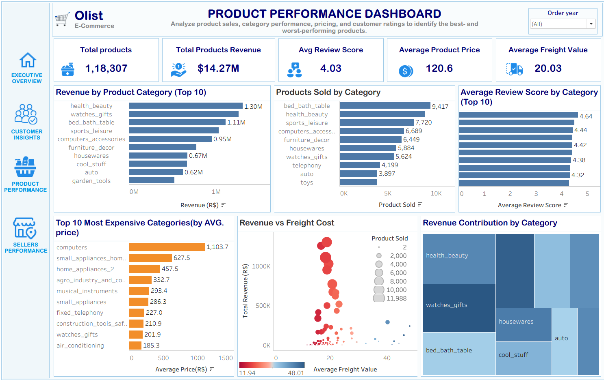
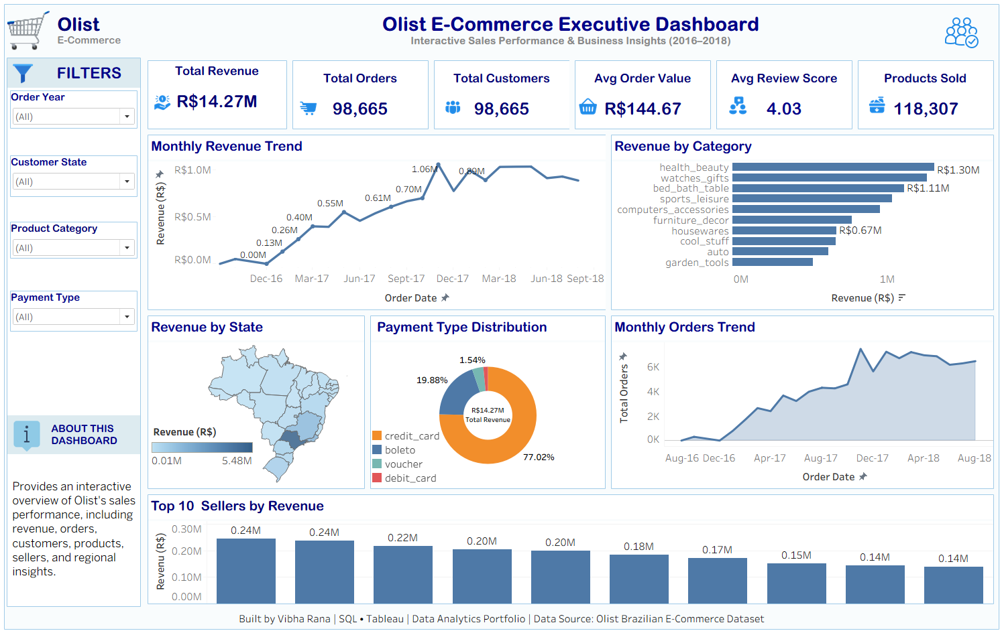
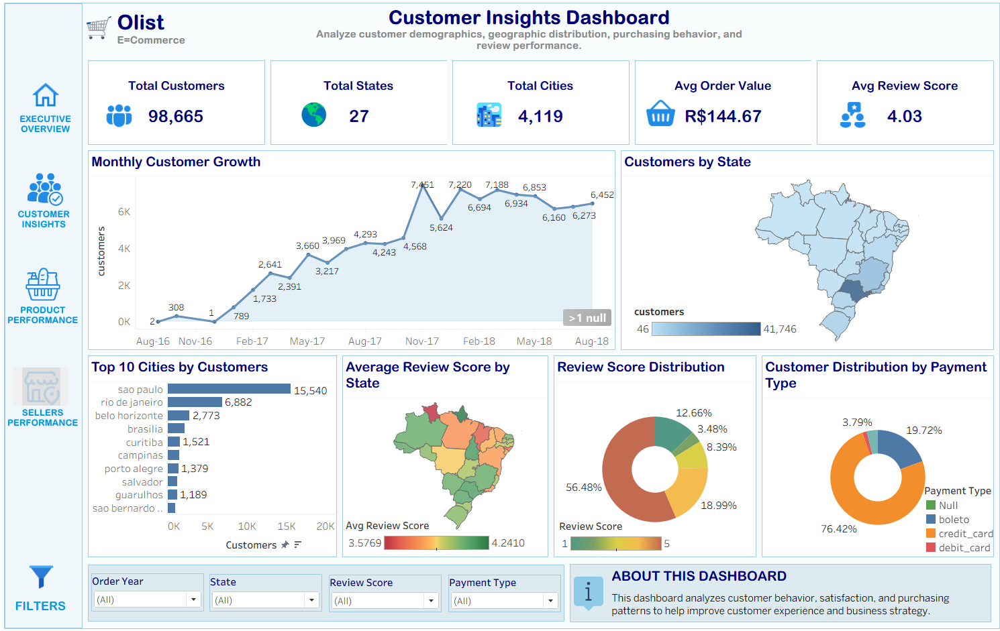
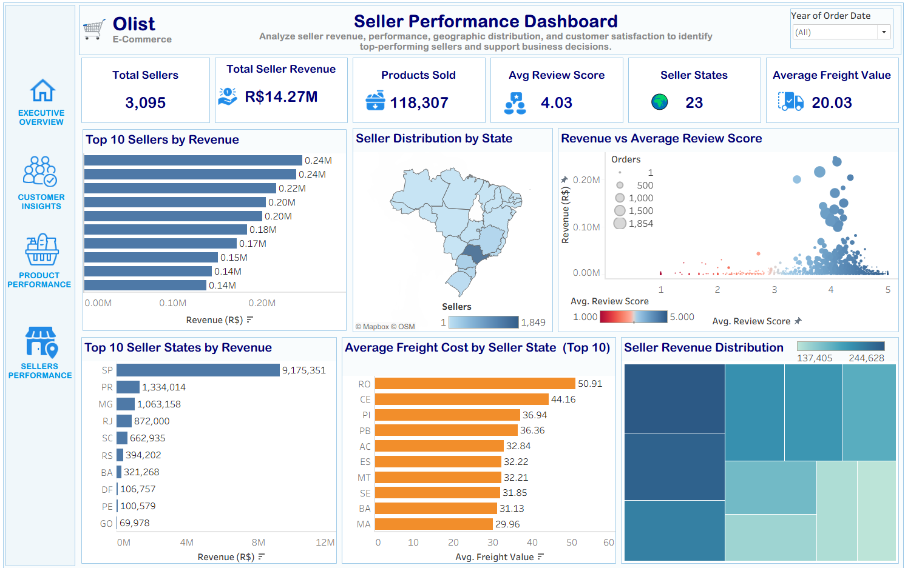

# 🛒 Olist E-commerce Sales Analysis

## 📌 Project Overview

This project is an end-to-end **Data Analytics** solution built using **SQL** and **Tableau**. The objective is to analyze the Brazilian Olist E-commerce dataset, uncover business insights, and develop interactive dashboards to support data-driven decision-making.

The project covers the complete analytics workflow, including data quality assessment, data cleaning, exploratory data analysis (EDA), KPI analysis, star schema design, and interactive dashboard development.

---

## 🎯 Business Objectives

- Analyze sales performance across different product categories.
- Understand customer purchasing behavior and satisfaction.
- Evaluate seller performance and regional contribution.
- Identify key business KPIs and trends.
- Build interactive dashboards for business stakeholders.
- Provide actionable business recommendations.

---

## 🛠️ Tools & Technologies

- **SQL Server** – Data Cleaning, Validation & Business Analysis
- **Tableau** – Interactive Dashboard Development
- **Microsoft Excel** – Initial Data Exploration
- **GitHub** – Project Documentation & Version Control

---

## 📊 Dataset

**Dataset:** Brazilian E-Commerce Public Dataset by Olist

**Source:** https://www.kaggle.com/datasets/olistbr/brazilian-ecommerce

> **Note:** The dataset is not included in this repository due to its large size. Please download it directly from Kaggle using the link above.

---

# 🔄 Project Workflow

```
Raw Olist Dataset
        │
        ▼
Database Schema
        │
        ▼
Data Quality Assessment
        │
        ▼
Data Cleaning & Validation (SQL)
        │
        ▼
Exploratory Data Analysis (EDA)
        │
        ▼
Business KPI Analysis
        │
        ▼
Advanced Business Analysis
        │
        ▼
Star Schema Design
        │
        ▼
Interactive Dashboard Development (Tableau)
        │
        ▼
Business Insights & Recommendations
```

---

# 📂 Repository Structure

```
📂 SQL Scripts
│── 01_Data_Quality.sql
│── 02_Data_Cleaning_Check.sql
│── 03_Data_Cleaning.sql
│── 04_Exploratory_Data_Analysis.sql
│── 05_Business_KPI_Analysis.sql
│── 06_Review_Delivery_Geography.sql
│── 07_Advanced_Business_Analysis.sql
│── 08_Star_Schema.sql

📂 Dashboards
│── Executive Dashboard
│── Customer Insights Dashboard
│── Product Performance Dashboard
│── Seller Performance Dashboard

📂 Report
│── Insights & Recommendations Report.pdf

📄 Olist_Ecommerce_Dashboard.twbx
📄 README.md
```

---

# 📈 Dashboard Overview

### 📌 Executive Dashboard
- Revenue Overview
- Sales Trends
- Product Category Performance
- Payment Distribution
- Regional Sales Analysis

### 👥 Customer Insights Dashboard
- Customer Growth
- Geographic Distribution
- Review Score Analysis
- Payment Preferences
- Top Customer Cities

### 📦 Product Performance Dashboard
- Product Revenue
- Category Performance
- Price Distribution
- Freight Cost Analysis
- Product Ratings

### 🏪 Seller Performance Dashboard
- Seller Revenue
- Top Sellers
- Seller Distribution
- Freight Analysis
- Seller Review Performance

---
# 📸 Dashboard Preview

# 📸 Dashboard Preview

## 📊 Executive Dashboard



---

## 👥 Customer Insights Dashboard



---

## 📦 Product Performance Dashboard



---

## 🏪 Seller Performance Dashboard


## 🏪 Seller Performance Dashboard


---

# 💡 Key Business Insights

- Generated **R$14.27M** in total revenue.
- Processed **98,665** customer orders.
- Sold **118,307** products across multiple categories.
- Achieved an average customer review score of **4.03/5**.
- Health & Beauty is the highest revenue-generating category.
- São Paulo contributes the highest customer and seller activity.
- Credit Card is the most preferred payment method.
- Revenue growth remained consistent throughout the analysis period.

---

# 🚀 Business Recommendations

- Increase inventory for high-performing product categories.
- Expand marketing efforts in underrepresented regions.
- Strengthen customer loyalty programs.
- Improve logistics to reduce freight costs.
- Support seller growth through performance-based incentives.
- Continue monitoring KPIs using interactive dashboards.

---

# 💼 Skills Demonstrated

- SQL Data Cleaning
- Data Validation
- Exploratory Data Analysis (EDA)
- Business KPI Analysis
- Star Schema Design
- Data Modeling
- Tableau Dashboard Development
- Business Intelligence
- Data Visualization
- Business Reporting
- Analytical Problem Solving

---

# 📬 Contact

**Vibha Rana**

- LinkedIn: *www.linkedin.com/in/vibha-rana*
- GitHub: *https://github.com/DS-xplorer*

---

⭐ If you found this project interesting, feel free to fork the repository or leave a star.
